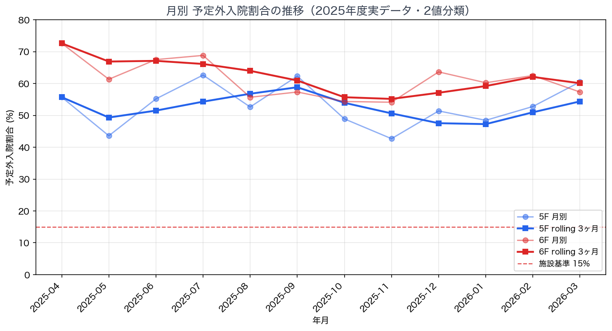
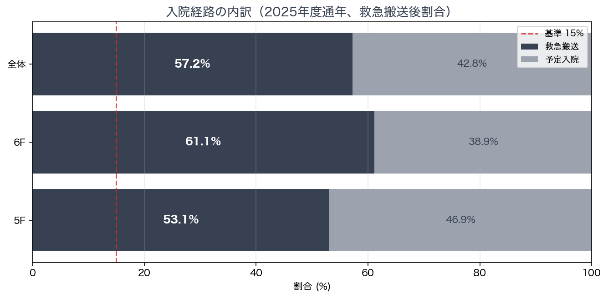
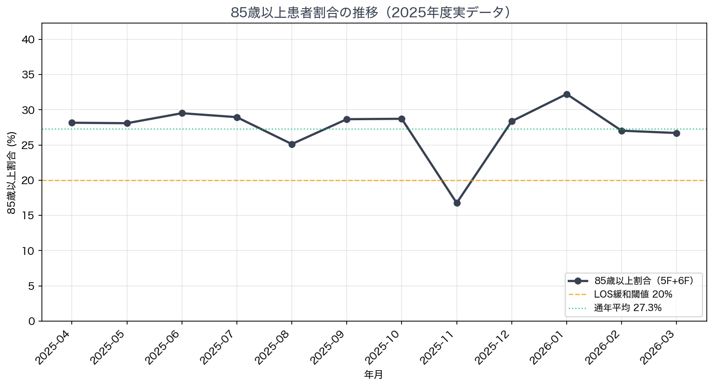

# 施設基準 実態レポート（2025年度実データ）

作成日: 2026-04-19
対象病院: おもろまちメディカルセンター（総病床数 94 床、5F / 6F 各 47 床）
データ: `/data/actual_admissions_2025fy.csv`（1,965 件、2025-04 〜 2026-03 の 12 ヶ月分）
計算対象病棟: 5F（外科・整形）、6F（内科・ペイン）※地域包括医療病棟

---

## エグゼクティブサマリー

### 指標ダッシュボード

| 指標 | 制度基準 | 当院実績 | 判定 |
|------|----------|----------|:----:|
| 救急搬送後患者割合（5F 通年） | 15% 以上 | **53.1%** | 🟢 |
| 救急搬送後患者割合（6F 通年） | 15% 以上 | **61.1%** | 🟢 |
| 救急搬送後割合 rolling 3ヶ月（5F、2026-01〜03） | 15% 以上 | **54.4%** | 🟢 |
| 救急搬送後割合 rolling 3ヶ月（6F、2026-01〜03） | 15% 以上 | **60.1%** | 🟢 |
| 85歳以上患者割合（5F+6F 通年） | 20% 以上で LOS 緩和 | **27.3%** | 🟢 |
| 平均在院日数 5F（推定） | 20 日以下（緩和時 21 日）※2026-06-01 以降本則 | **16.5 日** | 🟢 |
| 平均在院日数 6F（推定） | 20 日以下（緩和時 21 日）※2026-06-01 以降本則 | **15.6 日** | 🟢 |

### 結論（2026-06-01 本則完全適用時の安全性判断）

**🟢 現状の運営パターンなら問題なし**

- **救急搬送後 15%** — 5F **53.1%** / 6F **61.1%** で基準の約 3.5〜4.1 倍 → 余裕で達成
- **85歳以上 20%** — 通年 **27.3%**（閾値 +7.3pt）→ **LOS +1日緩和（20日 → 21日）の条件クリア**
- **平均在院日数（2026-06-01 以降: 20 日、緩和時 21 日）** — 推定 5F 16.5 日 / 6F 15.6 日（稼働率 90% 仮定での近似値、退院データ不在のため実績確認推奨）
- 注: 〜2026-05-31 の経過措置期間は現行ルール（21 日 / 緩和 22 日）が適用

---

## 1. 救急搬送後患者割合

### 制度基準（2026-06-01 以降）

- 地域包括医療病棟の入院患者について、**救急搬送後入院の割合が 15% 以上**
- 判定期間: **rolling 3 ヶ月**（2026-06-01 以降の本則）
- 病棟別: **5F / 6F 各病棟単体で判定**
- 分母: **短手3 を含む**（最初からカウント、除外しない）

### 通年実績

| 病棟 | 総入院数 | 救急搬送 | 通年救急率 | 基準との差 |
|------|----------:|----------:|-----------:|-----------:|
| 5F | 951 | 505 | **53.10%** | +38.10pt |
| 6F | 996 | 609 | **61.14%** | +46.14pt |

### rolling 3 ヶ月の最終値（2026-06-01 本則適用時と同じ計算方法）

| 病棟 | rolling 期間 | 合算入院数 | 合算救急数 | rolling 救急率 | 判定 |
|------|--------------|------------:|------------:|----------------:|:----:|
| 5F | 〜2026-03 | 217 | 118 | **54.38%** | 🟢 達成 |
| 6F | 〜2026-03 | 258 | 155 | **60.08%** | 🟢 達成 |

### 月別データ

#### 5F 月別

| 年月 | 入院総数 | 救急搬送 | 予定入院 | 月別救急率 | rolling 3ヶ月救急率 |
|------|----------:|----------:|----------:|-----------:|---------------------:|
| 2025-04 | 70 | 39 | 31 | 55.71% | 55.71% |
| 2025-05 | 78 | 34 | 44 | 43.59% | 49.32% |
| 2025-06 | 87 | 48 | 39 | 55.17% | 51.49% |
| 2025-07 | 91 | 57 | 34 | 62.64% | 54.30% |
| 2025-08 | 95 | 50 | 45 | 52.63% | 56.78% |
| 2025-09 | 69 | 43 | 26 | 62.32% | 58.82% |
| 2025-10 | 90 | 44 | 46 | 48.89% | 53.94% |
| 2025-11 | 82 | 35 | 47 | 42.68% | 50.62% |
| 2025-12 | 72 | 37 | 35 | 51.39% | 47.54% |
| 2026-01 | 64 | 31 | 33 | 48.44% | 47.25% |
| 2026-02 | 72 | 38 | 34 | 52.78% | 50.96% |
| 2026-03 | 81 | 49 | 32 | 60.49% | 54.38% |

#### 6F 月別

| 年月 | 入院総数 | 救急搬送 | 予定入院 | 月別救急率 | rolling 3ヶ月救急率 |
|------|----------:|----------:|----------:|-----------:|---------------------:|
| 2025-04 | 73 | 53 | 20 | 72.60% | 72.60% |
| 2025-05 | 75 | 46 | 29 | 61.33% | 66.89% |
| 2025-06 | 80 | 54 | 26 | 67.50% | 67.11% |
| 2025-07 | 93 | 64 | 29 | 68.82% | 66.13% |
| 2025-08 | 88 | 49 | 39 | 55.68% | 63.98% |
| 2025-09 | 75 | 43 | 32 | 57.33% | 60.94% |
| 2025-10 | 92 | 50 | 42 | 54.35% | 55.69% |
| 2025-11 | 85 | 46 | 39 | 54.12% | 55.16% |
| 2025-12 | 77 | 49 | 28 | 63.64% | 57.09% |
| 2026-01 | 88 | 53 | 35 | 60.23% | 59.20% |
| 2026-02 | 88 | 55 | 33 | 62.50% | 62.06% |
| 2026-03 | 82 | 47 | 35 | 57.32% | 60.08% |

### 可視化





---

## 2. 平均在院日数（推定値）

### 制度基準（2026-06-01 以降の本則完全適用）

- 平均在院日数 **20 日以下**（2026-06-01 以降、現行 21 日から **1 日短縮**）
- ただし **85歳以上割合が 20% 以上**の場合は **+1 日緩和 → 21 日以下**
- 〜2026-05-31 の経過措置期間は現行ルール（21 日以下 / 緩和時 22 日）

### 注意事項

本レポートの LOS は**推定値**です。退院データがないため、以下の近似式で算出しています:

```
LOS ≈ (病床数 × 稼働率 × 月日数) / 月入院数
```

- 稼働率は当院目標値 **90%** を仮定
- 実際の稼働率・退院タイミングの揺らぎを含まない
- **実績ベースの LOS は病院管理データ（admission/discharge ペア）からの別途算出を推奨**

### 推定 LOS（通年平均）

| 病棟 | 通年平均 入院数/月 | 推定 LOS（日） | 制度上限 | 判定 |
|------|-------------------:|---------------:|---------:|:----:|
| 5F | 79.2 | **16.5** | 21 | 🟢 |
| 6F | 83.0 | **15.6** | 21 | 🟢 |

### 月別推定 LOS

#### 5F（病床数 47、想定稼働率 90%）

| 年月 | 入院数 | 月日数 | 推定LOS(日) |
|------|--------:|--------:|-------------:|
| 2025-04 | 70 | 30 | 18.1 |
| 2025-05 | 78 | 31 | 16.8 |
| 2025-06 | 87 | 30 | 14.6 |
| 2025-07 | 91 | 31 | 14.4 |
| 2025-08 | 95 | 31 | 13.8 |
| 2025-09 | 69 | 30 | 18.4 |
| 2025-10 | 90 | 31 | 14.6 |
| 2025-11 | 82 | 30 | 15.5 |
| 2025-12 | 72 | 31 | 18.2 |
| 2026-01 | 64 | 31 | 20.5 |
| 2026-02 | 72 | 28 | 16.5 |
| 2026-03 | 81 | 31 | 16.2 |

#### 6F（病床数 47、想定稼働率 90%）

| 年月 | 入院数 | 月日数 | 推定LOS(日) |
|------|--------:|--------:|-------------:|
| 2025-04 | 73 | 30 | 17.4 |
| 2025-05 | 75 | 31 | 17.5 |
| 2025-06 | 80 | 30 | 15.9 |
| 2025-07 | 93 | 31 | 14.1 |
| 2025-08 | 88 | 31 | 14.9 |
| 2025-09 | 75 | 30 | 16.9 |
| 2025-10 | 92 | 31 | 14.3 |
| 2025-11 | 85 | 30 | 14.9 |
| 2025-12 | 77 | 31 | 17.0 |
| 2026-01 | 88 | 31 | 14.9 |
| 2026-02 | 88 | 28 | 13.5 |
| 2026-03 | 82 | 31 | 16.0 |

---

## 3. 85歳以上患者割合（LOS 緩和の条件）

### 制度基準（2026-06-01 以降の本則）

- 85歳以上の入院患者割合が **20% 以上** で、平均在院日数の上限が 20 → **+1 日緩和 = 21 日**
- 参考: 〜2026-05-31 の経過措置期間は 21 → 22 日（いずれも +1 日緩和）

### 通年実績（5F+6F）

- **通年 85歳以上割合: 27.30%**（閾値 +7.30pt）
- 5F のみ: 25.00%
- 6F のみ: 29.49%

### 月別推移（5F+6F）

| 年月 | 入院総数 | 85歳以上 | 割合 |
|------|----------:|----------:|-----:|
| 2025-04 | 142 | 40 | 28.17% |
| 2025-05 | 153 | 43 | 28.10% |
| 2025-06 | 166 | 49 | 29.52% |
| 2025-07 | 183 | 53 | 28.96% |
| 2025-08 | 183 | 46 | 25.14% |
| 2025-09 | 143 | 41 | 28.67% |
| 2025-10 | 181 | 52 | 28.73% |
| 2025-11 | 167 | 28 | 16.77% |
| 2025-12 | 148 | 42 | 28.38% |
| 2026-01 | 152 | 49 | 32.24% |
| 2026-02 | 159 | 43 | 27.04% |
| 2026-03 | 161 | 43 | 26.71% |

### 可視化



---

## 4. 高齢者比率全般

| 年齢区分 | 5F+6F 通年割合 |
|----------|----------------:|
| 65歳以上 | **71.00%** |
| 75歳以上 | **50.41%** |
| 85歳以上 | **27.30%** |

対象: 5F+6F の入院 1,938 件（年齢記載あり）

---

## 5. 副院長の運用判断に使える観点

### (1) 救急搬送後 15% は大幅達成 — 戦略的余力あり

- 5F **53.1%** / 6F **61.1%** は基準の 3.5〜4.1 倍
- → **短手3（予定入院）を増やす余地**は制度上十分にある
- 副院長校正値: 月間短手3 約 22 名（うち Day 6 超過は約 1 名/月、4.5%）
- Day 6 超過患者も 8 日以内で退院しており、LOS 階段関数（短手3 Day 5 境界）の影響は限定的

### (2) 85歳以上割合が高い → LOS 緩和の恩恵を受けられる

- 通年 **27.3%** で閾値 20% を余裕でクリア
- 2026-06-01 以降の本則（基準 20 日）に対し **+1 日緩和 → 21 日** が適用可能
- ベッドコントロール上、**+1 日分の運用余裕**を生み出せる
- 参考: 経過措置期間（〜2026-05-31）は現行ルール 21 → 22 日の緩和

### (3) rolling 3 ヶ月判定でも安定

- 2026-06-01 の本則完全適用後、単月の揺らぎに左右されず **3 ヶ月合算**で判定される
- 当院の rolling 3ヶ月最終値（2026-01〜03）は 5F **54.4%** / 6F **60.1%** で安定達成
- 月別変動（42.7%〜62.6%）があっても、通年通じて一度も基準割れしていない

---

## 6. データについての注記

- 本データは 2025-04-01 〜 2026-03-31 の入院イベントのみ（退院データなし）
- CSV 上の `short3_type` 列は全て NaN（短手3 の個別フラグはついていない）。実態は副院長校正で月間 22 名前後
- 年齢は階級集計のみ（個人特定を避けるため個別年齢は非掲載）
- 4F の 18 件は地域包括医療病棟に該当しないため本レポートの施設基準計算から除外
- LOS は近似値（稼働率 90% 仮定）。実績 LOS は別データでの算出を推奨

### データ出典

- `/Users/torukubota/ai-management/data/actual_admissions_2025fy.csv`

### 関連ドキュメント

- [CLAUDE.md 「制度ルール確定事項」](../../CLAUDE.md)
- [`scripts/emergency_ratio.py`](../../scripts/emergency_ratio.py)

---

*生成: `scripts/generate_facility_criteria_report.py`*
